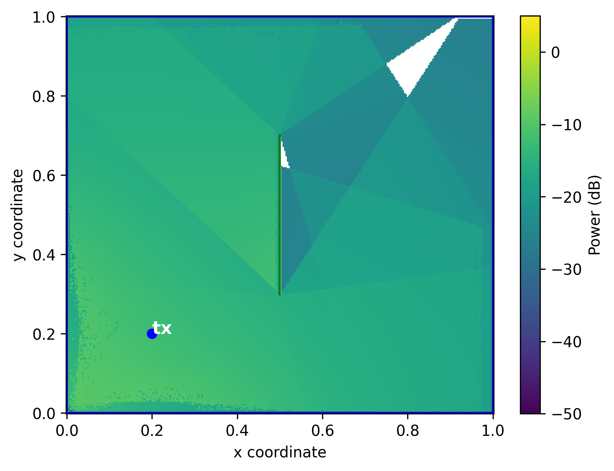
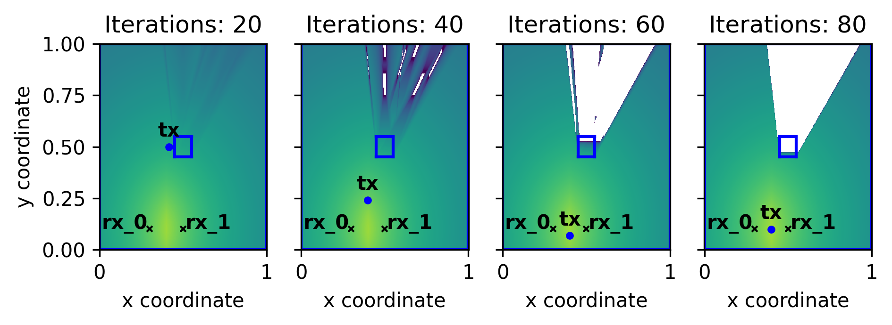

**DiffeRT2d**: A Differentiable Ray Tracing Python Framework for Radio Propagation

*Jérome Eertmans - 2024-06-16*

---

## Second slide

> Best quote ever.

Note: speaker notes FTW!

---

## Examples

* [Exploring Metasurfaces and More](#/example1)
* [Network optimization](#/example2)
* [Machine Learning](#/example3)

---

<!-- .slide: id="example1" -->



RIS model that always reflects with an angle of 45°.

----

**Min-Path-Tracing<sup>1</sup>**: tracing ray paths by minimizing the sum of individual interaction functions.

```python
class RIS(Wall):
  phi  # The constant angle of reflection

  def evaluate_cartesian(self, ray_path):
    # Reflecting segment
    v2 = ray_path[2, :] - ray_path[1, :]
    n = self.normal()
    sinx = jnp.cross(n, v2)
    sina = jnp.linalg.norm(v2)  * jnp.sin(self.phi)
    # Result to be minimized by
    # the Min-Path-Tracing method
    return (sinx - sina) ** 2
```

 <div style="text-align: left; font-size: 10px">1: J. Eertmans, C. Oestges and L. Jacques, "Min-Path-Tracing: A Diffraction Aware Alternative to Image Method in Ray Tracing," 2023 17th European Conference on Antennas and Propagation (EuCAP), Florence, Italy, 2023, pp. 1-5, doi: 10.23919/EuCAP57121.2023.10132934.</div>

----

```python [1|2-5|6|7|8-14]
scene = Scene.square_scene()
ris = RIS(
  xys=jnp.array([[0.5, 0.3], [0.5, 0.7]]),
  phi=jnp.pi / 4,  # 45°
)
scene = scene.add_objects(ris)
X, Y = scene.grid(n=300)
P = scene.accumulate_on_receivers_grid_over_paths(
  X, Y,
  fun=received_power,
  path_cls=MinPath,
  order=1,
  ...,
)
```

---

<!-- .slide: id="example2" -->

Network optimization: finding the best TX location<sup>2</sup>.



----

$$\mathcal{F}(x,y)=\min{\left(P_\text{rx\_0}, P_\text{rx\_1}\right)}$$

```python [1-6|1|3-4|9|10|13]
def objective_function(received_power_per_receiver):
  min_power = jnp.array(jnp.inf)
  for p in received_power_per_receiver:
      min_power = jnp.minimum(min_power, p)

  return min_power


def loss(tx_coords, scene):
  return -objective_function(...)


f_and_df = jax.value_and_grad(loss)
```

<div style="text-align: left; font-size: 10px">2: Jérome Eertmans, Laurent Jacques, Claude Oestges, "Fully Differentiable Ray Tracing via Discontinuity Smoothing for Radio Network Optimization", 2024 18th European Conference on Antennas and Propagation (EuCAP), pp.1-5, 2024.</div>

---

<!-- .slide: id="example3" -->

PTDR

---


---

## Thanks for you attention!


