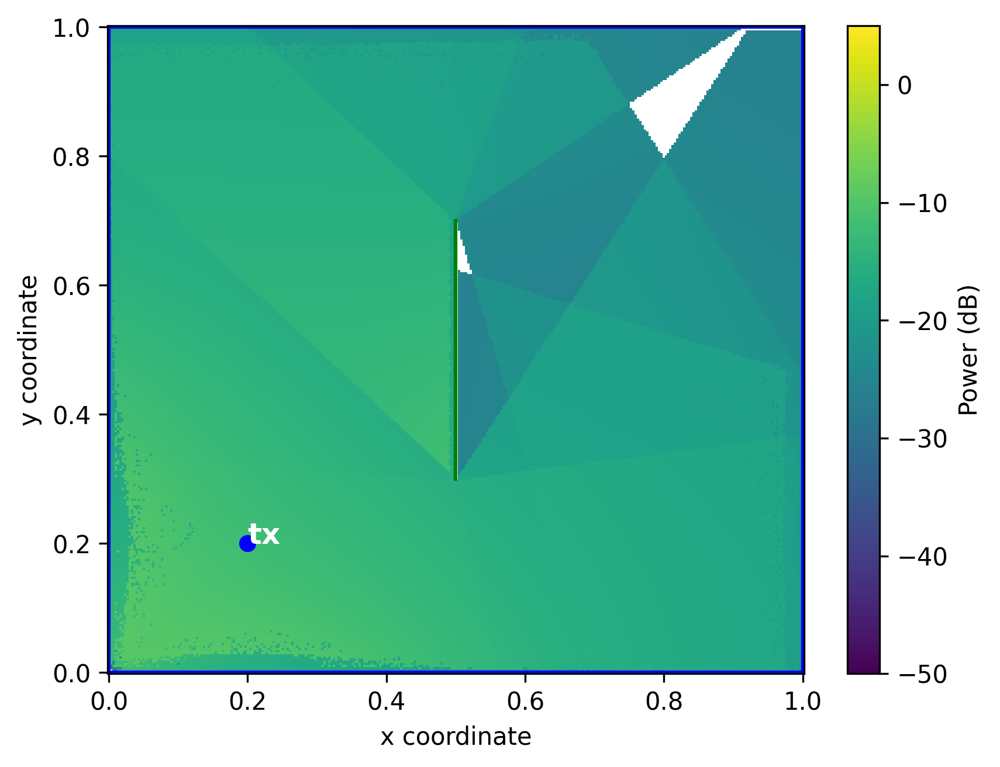
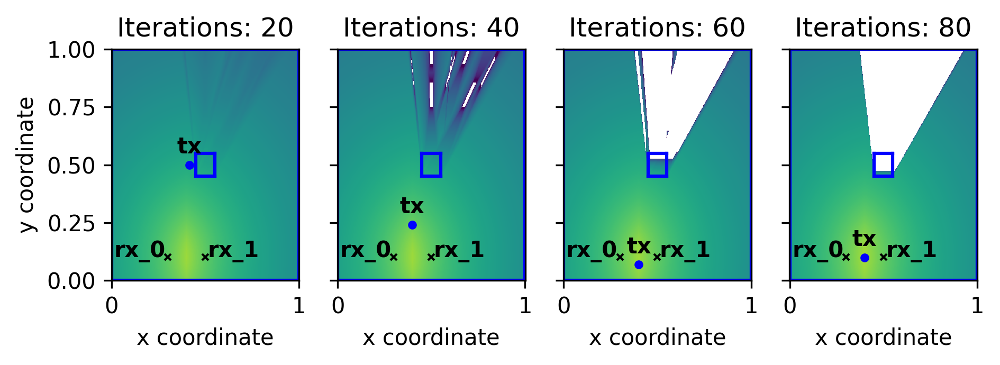
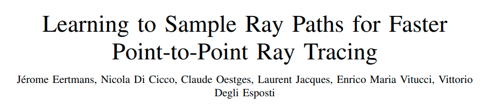
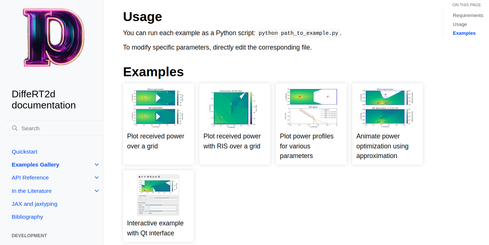

**DiffeRT2d**: A Differentiable Ray Tracing Python Framework for Radio Propagation

*Jérome Eertmans - 2024-06-16*

Note: Welcome everyone to this non-technical
  presentation of our Differentiable Ray Tracing framework:
  DiffeRT2d.

---

<!-- .slide: data-auto-animate id="soft" -->

**Ray Tracing Software for Radio Propagation:**

* [SionnaRT](https://github.com/NVlabs/sionna)
* [MatLab](https://www.mathworks.com/help/comm/ref/rfprop.raytracing.html)
* [Wireless InSite](https://www.remcom.com/wireless-insite-propagation-software)
* [PyLayers](https://github.com/pylayers/pylayers)
* [Opal](https://gitlab.com/esteban.egea/opal)
* [CloudRT](http://world.raytracer.cloud/go-to-cloudrt)
* [MURT](https://github.com/tamsri/murt)
* [Wavetrace](https://github.com/NZRS/wavetrace)

<div data-id="question">Which tool should I use?</div>

Note: Depending on your field of research, you may face a relatively
  large choice in terms of RT software. However, if you start
  setting up some constraints, the choice is rapidly reduced.

---

<!-- .slide: data-auto-animate -->

**Ray Tracing Software for Radio Propagation:**

* [SionnaRT](https://github.com/NVlabs/sionna)
* [MatLab](https://www.mathworks.com/help/comm/ref/rfprop.raytracing.html) <!-- .element: style="opacity: 0.5;" -->
* [Wireless InSite](https://www.remcom.com/wireless-insite-propagation-software) <!-- .element: style="opacity: 0.5;" -->
* [PyLayers](https://github.com/pylayers/pylayers)
* [Opal](https://gitlab.com/esteban.egea/opal)
* [CloudRT](http://world.raytracer.cloud/go-to-cloudrt) <!-- .element: style="opacity: 0.5;" -->
* [MURT](https://github.com/tamsri/murt)
* [Wavetrace](https://github.com/NZRS/wavetrace)

<div data-id="question">Free and Open Source?</div>

Note: Is the software free or open source?
  Maybe not important to everyone, but I feel like (1) I want to be able
  to understand the code I use and (2) be able to share my code with others,
  without them depending on a commercial product that costs a lot of money.

---

<!-- .slide: data-auto-animate -->

**Ray Tracing Software for Radio Propagation:**

* [SionnaRT](https://github.com/NVlabs/sionna)
* [MatLab](https://www.mathworks.com/help/comm/ref/rfprop.raytracing.html)
* [Wireless InSite](https://www.remcom.com/wireless-insite-propagation-software)
* [PyLayers](https://github.com/pylayers/pylayers) <!-- .element: style="opacity: 0.5;" -->
* [Opal](https://gitlab.com/esteban.egea/opal)
* [CloudRT](http://world.raytracer.cloud/go-to-cloudrt)
* [MURT](https://github.com/tamsri/murt) <!-- .element: style="opacity: 0.5;" -->
* [Wavetrace](https://github.com/NZRS/wavetrace) <!-- .element: style="opacity: 0.5;" -->

<div data-id="question">Actively maintained?</div>

Note: Is is actively (in the past 3 years) maintained?
  A software does not have to be maintained to be good,
  but it is oftentimes a sign that you will hardly get
  any help if you need some.

---

<!-- .slide: data-auto-animate -->

**Ray Tracing Software for Radio Propagation:**

* [SionnaRT](https://github.com/NVlabs/sionna)
* [MatLab](https://www.mathworks.com/help/comm/ref/rfprop.raytracing.html)
* [Wireless InSite](https://www.remcom.com/wireless-insite-propagation-software) <!-- .element: style="opacity: 0.5;" -->
* [PyLayers](https://github.com/pylayers/pylayers)
* [Opal](https://gitlab.com/esteban.egea/opal) <!-- .element: style="opacity: 0.5;" -->
* [CloudRT](http://world.raytracer.cloud/go-to-cloudrt) <!-- .element: style="opacity: 0.5;" -->
* [MURT](https://github.com/tamsri/murt)
* [Wavetrace](https://github.com/NZRS/wavetrace)

<div data-id="question">Accessible programming language?</div>

Note: Does it provide an API in a relatively user-friend programming language,
  like Python or MatLab? I think that complex languages, like C++, can be a barrier
  to some researchers.

---

<!-- .slide: data-auto-animate -->

**Ray Tracing Software for Radio Propagation:**

* [SionnaRT](https://github.com/NVlabs/sionna)
* [MatLab](https://www.mathworks.com/help/comm/ref/rfprop.raytracing.html) <!-- .element: style="opacity: 0.5;" -->
* [Wireless InSite](https://www.remcom.com/wireless-insite-propagation-software) <!-- .element: style="opacity: 0.5;" -->
* [PyLayers](https://github.com/pylayers/pylayers) <!-- .element: style="opacity: 0.5;" -->
* [Opal](https://gitlab.com/esteban.egea/opal) <!-- .element: style="opacity: 0.5;" -->
* [CloudRT](http://world.raytracer.cloud/go-to-cloudrt) <!-- .element: style="opacity: 0.5;" -->
* [MURT](https://github.com/tamsri/murt) <!-- .element: style="opacity: 0.5;" -->
* [Wavetrace](https://github.com/NZRS/wavetrace) <!-- .element: style="opacity: 0.5;" -->

<div data-id="question">Provides automatic differentiation?</div>

Note: Does it use an auto-diff framework?
  AD has been recently pushed to RT software and enable computing
  derivatives with respect to almost any variable, making
  optimization straightforward.

---

<!-- .slide: data-auto-animate -->

**Ray Tracing Software for Radio Propagation:**

* [SionnaRT](https://github.com/NVlabs/sionna) <!-- .element: style="opacity: 0.5;" -->
* [MatLab](https://www.mathworks.com/help/comm/ref/rfprop.raytracing.html) <!-- .element: style="opacity: 0.5;" -->
* [Wireless InSite](https://www.remcom.com/wireless-insite-propagation-software) <!-- .element: style="opacity: 0.5;" -->
* [PyLayers](https://github.com/pylayers/pylayers) <!-- .element: style="opacity: 0.5;" -->
* [Opal](https://gitlab.com/esteban.egea/opal) <!-- .element: style="opacity: 0.5;" -->
* [CloudRT](http://world.raytracer.cloud/go-to-cloudrt) <!-- .element: style="opacity: 0.5;" -->
* [MURT](https://github.com/tamsri/murt) <!-- .element: style="opacity: 0.5;" -->
* [Wavetrace](https://github.com/NZRS/wavetrace) <!-- .element: style="opacity: 0.5;" -->

<div data-id="question">Easily customizable?</div>

Note: Can you easily customize the RT?
  Can you handle complex objects (not always bare triangle primitives),
  similate higher-order diffractions, or use something else
  than Image Method?

---

<!-- .slide: id="statement" -->

**Statement of Need**

We think the research community is lacking: <!-- .element: align="left" -->

* an easy to use, <!-- .element: class="fragment" -->
* differentiable, <!-- .element: class="fragment" -->
* free and Open Source, <!-- .element: class="fragment" -->
* and highly customizable <!-- .element: class="fragment" -->

Ray Tracing toolbox. <!-- .element: class="fragment" align="left" -->

Note: We think the research community is lacking simple
  to use tool for fundamental research on RT.

---

**Contents**

1. [Ray Tracing Software list](#/soft) <!-- .element: style="opacity: 0.5;" -->
2. [Statement of Need](#/statement) <!-- .element: style="opacity: 0.5;" -->
3. [The DiffeRT2d Python library](#/library)
4. [Examples](#/examples)
5. [How to get DiffeRT2d](#/howto)

---

<!-- .slide: data-auto-animate id="library" -->

**DiffeRT2d**

<div data-id="what">What it is:</div>

* a object-oriented Python library; <!-- .element: class="fragment" -->
* a 2D Ray Tracing framework; <!-- .element: class="fragment" -->
* differentiable everywhere; <!-- .element: class="fragment" -->
* highly customizable <!-- .element: class="fragment" -->
* and it supports the following methods: <!-- .element: class="fragment" -->
  + image method; <!-- .element: class="fragment" -->
  + Fermat's principle base minimization; <!-- .element: class="fragment" -->
  + and Min-Path-Tracing; <!-- .element: class="fragment" -->

Note: Our tool ticks the following.

---

<!-- .slide: data-auto-animate -->

**DiffeRT2d**

<div data-id="what">What it isn't:</div>

* a replacement of SionnaRT; <!-- .element: class="fragment" -->
* a fully featured radio-link simulator; <!-- .element: class="fragment" -->
* or a 3D library. <!-- .element: class="fragment" -->

Note: What our tool is not.

---

<!-- .slide: id="examples" -->

**Examples**

* [Exploring Metasurfaces and More](#/example_ris)
* [Network optimization](#/example_opti)
* [Machine Learning](#/example_ml)
* [Graphical interface](#/qt)

Note: Now, we will quickly go through some example use-cases
  of our library.

---

<!-- .slide: id="example_ris" -->

(Example)

RIS model that always reflects with an angle of 45°.



Note: When studying RT, you may want to handle more complex objects or
  interactions, or path tracing methods. In this example, we should
  how you can simulate, using our tool, a simple RIS model, that
  always reflects incident rays with a reflection angle of 45°.

----

**Min-Path-Tracing<sup>1</sup>**: tracing ray paths by minimizing the sum of individual interaction functions.

```python [1|2|4|5-7|8-11|12|-]
class RIS(Wall):
  phi  # The constant angle of reflection

  def evaluate_cartesian(self, ray_path):
    r = ray_path[2, :] - ray_path[1, :]  # Reflected
    n = self.normal()  # Normal
    r, _ = normalize(r)
    sin_a = jnp.cross(-r, n)
    cos_a = jnp.dot(-r, n)
    sin_p = jnp.sin(self.phi)
    cos_p = jnp.cos(self.phi)
    return (sin_a - sin_p) ** 2 + (cos_a - cos_p) ** 2
```

<div style="text-align: left; font-size: 10px">1: J. Eertmans, C. Oestges and L. Jacques, "Min-Path-Tracing: A Diffraction Aware Alternative to Image Method in Ray Tracing," 2023 17th European Conference on Antennas and Propagation (EuCAP), Florence, Italy, 2023, pp. 1-5, doi: 10.23919/EuCAP57121.2023.10132934.</div>

Note: Thanks to OOP, we can define arbitrary complex objects by subclassing
  a set of base classes. For example, we define a simple RIS to be similar
  to a wall, except that we want to re-radiate all rays with a fixed reflection
  angle, phi. Note that this is a simplistic approximation of an RIS.

  Next, we will our MPT method to trace the ray paths, because standard
  methods do not support that kind of interactions.

  We define some interaction function that evaluates the local interaction,
  returning as strictly positive value if the angle is different than phi,
  zero otherwise.

----

Constructing a scene is very simple!

```python [1|2-5|6|7|8-14|-]
scene = Scene.square_scene()
ris = RIS(
  xys=jnp.array([[0.5, 0.3], [0.5, 0.7]]),
  phi=jnp.pi / 4,  # 45°
)
scene = scene.add_objects(ris)
X, Y = scene.grid(n=300)
P = scene.accumulate_on_receivers_grid_over_paths(
  X, Y,
  fun=received_power,
  path_cls=MinPath,
  order=1,
  ...,
)
```

Note: Here we construct the scene by using a factory
  method to create a basic square scene, and we add a RIS in the middle of the
  scene. Next, we simply construct a grid of RX coordinates and evaluate
  the received power on each of those coordinates.

  Note that we are only simulating first-order interaction,
  not the line of sight paths, to emphasize the effect of the RIS.

---

<!-- .slide: id="example_opti" -->

(Example)

Network optimization: finding the best TX location<sup>2</sup>.



<div style="text-align: left; font-size: 10px">2: Jérome Eertmans, Laurent Jacques, Claude Oestges, "Fully Differentiable Ray Tracing via Discontinuity Smoothing for Radio Network Optimization", 2024 18th European Conference on Antennas and Propagation (EuCAP), pp.1-5, 2024.</div>

Note: In a previous paper, published at EuCAP 2024, we presented a general
  RT framework for handling discontinuties in RT, and how they might affect
  some optimization problems. Our tool implements this solution and
  can successfully solve optimization problems, like finding the best
  transmitting antenna location.

----

$$\mathcal{F}(x,y)=\min{\left(P_\text{rx\_0}, P_\text{rx\_1}\right)}$$

```python [1-6|1|3-4|9|10|13|-]
def objective_function(received_power_per_receiver):
  min_power = jnp.array(jnp.inf)
  for p in received_power_per_receiver:
      min_power = jnp.minimum(min_power, p)

  return min_power


def loss(tx_coords, scene):
  return -objective_function(...)


f_and_df = jax.value_and_grad(loss)
```

Note: Every optimization function starts with some objective function.
  Here, we want to maximize to received power by either receivers.
  Simply, we objective function returns the minimum of the received
  powers. Then, we define the loss function to be the opposite of
  the aforementioned function, so that minimizing
  the loss amounts to maximizing our objective function.

  Finally, thanks to AD, we construct a function that
  will return the loss value and it gradient with respect
  to the TX coordinates.

----

Gradient-based minimization of the loss:

```python
optim = optax.adam(learning_rate=0.01)
opt_state = optim.init(tx_coords)

for step in range(num_steps):
  loss, grads = f_and_df(
      tx_coords,
      scene,
      ...
  )
  updates, opt_state = optim.update(grads, opt_state)
  tx_coords = tx_coords + updates
```

Note: Since we have the loss and its gradient for free,
  performing a gradient-based minimization becomes
  straightforward.

---

<!-- .slide: id="example_ml" -->

(Example)

Machine Learning model trained with DiffeRT2d



Note: I will be very quick on this, as we presented another TD
  about some Machine Learning model we developed and trained
  using this tool (DiffeRT2d). If you are curious to see
  how we did, please checkout the paper or the notebook we
  share.

---

<!-- .slide: id="qt" -->


Note: Finally, our library includes an interactive
  graphical interface that can be used to quickly
  understand how RT works on a very basic 2D scene.

---

<!-- .slide: id="howto" data-auto-animate -->

## Usage

<div data-id="usage-text">Install the Python package:</div>

```bash
pip install differt2d
```

---

<!-- .slide: data-auto-animate -->

## Usage

<div data-id="usage-text">Read the documentation:</div>



---

## Usage

<!-- .slide: data-auto-animate -->

<div data-id="usage-text">Review and inspect the code:</div>

https://github.com/jeertmans/DiffeRT2d

---

<!-- .slide: data-auto-animate -->


<div data-id="usage-text">Thanks for your attention!</div>
